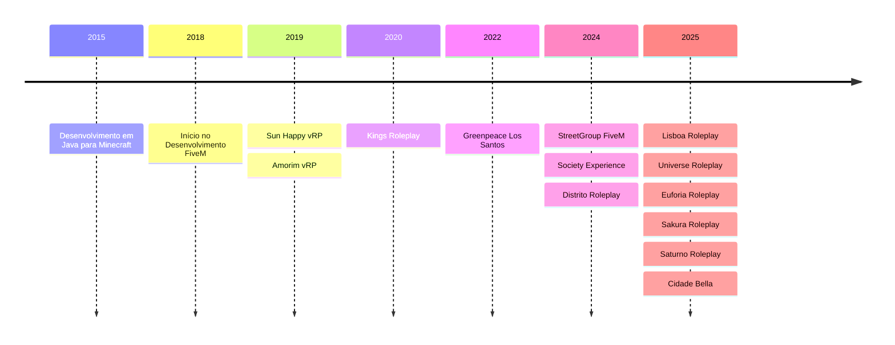

# Gabriel Passos
## Desenvolvedor Full Stack & Designer UI/UX

<div align="center">

🚀 **Transformando ideias em experiências digitais excepcionais desde 2018**

</div>

---

### 👨‍💻 Sobre Mim

Sou um Desenvolvedor Full Stack de 18 anos, apaixonado por criar soluções inovadoras e experiências imersivas. Especializado no desenvolvimento para FiveM desde 2018, trago uma combinação única de expertise técnica e pensamento criativo em design para cada projeto.

### 🛠️ Arsenal Técnico

```javascript
const skills = {
    frontend: [
        "React", "Next.js", "TypeScript",
        "HTML5", "CSS3", "JavaScript",
        "TailwindCSS", "Vite"
    ],
    backend: [
        "Node.js", "Express.js", "PHP",
        "Python", "Lua", "Java"
    ],
    database: ["MongoDB", "SQL"],
    fivemdev: [
        "vRP 0.5", "vRP 1.0", "vRP 2.0",
        "vRP 3.0", "ESX", "QBCore", "QBox"
    ],
    design: ["UI/UX Design", "Figma", "VFX", "Image Composition"]
}
```

### 🌟 Projetos em Destaque

#### Society Experience (2024)
Uma experiência inovadora no FiveM que revoluciona o GTA RP com recursos inovadores e mecânicas de jogo imersivas.

#### Greenpeace Los Santos +3C (2022-2023)
🏆 **Projeto premiado apresentado na Globo**
- Arquitetura backend utilizando Lua, JavaScript e Node.js
- Destaque em grandes veículos de mídia por sua abordagem inovadora à conscientização ambiental

#### FiveM Battle Royale Framework
- Desenvolvi independentemente um framework Battle Royale open-source
- Solução completa para servidores FiveM
- Demonstra mecânicas avançadas de jogo e otimização

### 📈 Timeline



### 🏆 Cases de Sucesso

1. **Amorim vRP**
   - Uma base renomada de FiveM Roleplay
   - Ganhou amplo reconhecimento na comunidade

2. **FiveM Discord Bot**
   - Integrações automatizadas com sistemas de RP
   - Melhorou a eficiência da administração de servidores

3. **Distrito Experience**
   - Criei uma experiência inovadora de GTA RP
   - Implementei elementos transformadores de jogabilidade

### 💼 Experiência Profissional

```typescript
interface Experience {
    company: string;
    role: string;
    period: string;
    technologies: string[];
}

const experiences: Experience[] = [
    {
        company: "Minecraft Plugins",
        role: "Backend Developer",
        period: "2015-2019",
        technologies: ["Java"]
    },
    {
        company: "Amorim vRP",
        role: "Backend Developer",
        period: "2019-2021",
        technologies: ["Lua"]
    },
    {
        company: "Kings Roleplay",
        role: "Full Stack Developer",
        period: "2020-2023",
        technologies: ["Lua", "JavaScript", "HTML", "CSS", "Node.js"]
    },
    {
        company: "Greenpeace Los Santos",
        role: "Backend Developer",
        period: "2022-2023",
        technologies: ["Lua", "JavaScript", "Node.js"]
    },
    {
        company: "StreetGroup FiveM",
        role: "Full Stack Developer",
        period: "2024",
        technologies: ["Lua", "JavaScript", "HTML", "CSS", "Node.js"]
    },
    {
        company: "Society Experience",
        role: "Full Stack Developer",
        period: "2024",
        technologies: ["Lua", "JavaScript", "HTML", "CSS", "Node.js"]
    },
    {
        company: "Distrito Experience",
        role: "Full Stack Developer",
        period: "2024-2025",
        technologies: ["Lua", "JavaScript", "HTML", "CSS", "Node.js"]
    },
    {
        company: "Garty Group's FiveM Servers",
        role: "Backend Developer",
        period: "2025-current",
        technologies: ["Lua", "JavaScript"]
    },
];
```

### 🌐 Let's Connect!

Estou sempre animado para colaborar em projetos inovadores e explorar novas oportunidades. Se você deseja revolucionar seu servidor FiveM ou precisa de um desenvolvedor Full Stack que traga soluções criativas para problemas complexos, estou aqui para ajudar!

---

<div align="center">

**"Criando experiências digitais imersivas que ultrapassam os limites do possível"**

</div>
