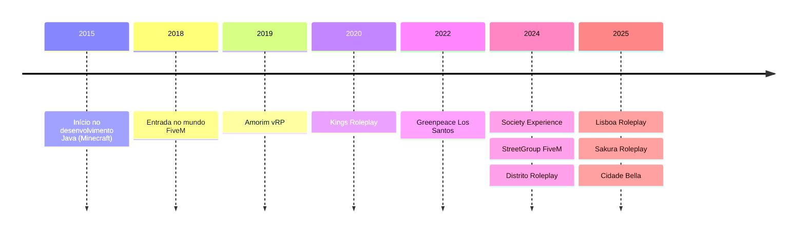

# Gabriel Passos
## Back-End Developer && FiveM Specialist

<div align="center">

🚀 **Transformando ideias em soluções escaláveis e experiências digitais imersivas desde 2018**

</div>

---

### 👨‍💻 About Me

Sou um desenvolvedor **Back-End** de 18 anos, apaixonado por **tecnologia, automação e criação de experiências únicas no ecossistema FiveM**.  
Atuando desde 2018, combino performance, arquitetura sólida e design de sistemas para entregar projetos que se destacam pela eficiência e inovação.

💼 Atualmente: **Back-End Developer** em **Lisboa Group, Sakura RP e Cidade Bella**

---

### 🛠️ Stack Técnica

```javascript
const backendSkills = {
    languages: ["Node.js", "Lua", "Python", "Java"],
    frameworks: ["Express.js", "vRP (0.5 - 3.0)", "ESX", "QBCore", "QBox"],
    databases: ["SQL"],
    tools: ["Git", "REST APIs", "WebSocket"]
}
```

---

### 🌟 Projetos em Destaque

#### 🏙️ Society Experience (2024)
Uma experiência inovadora no FiveM que redefine o GTA RP com **recursos avançados**, **mecânicas imersivas** e **integrações otimizadas**.

#### 🌿 Greenpeace Los Santos +3C (2022–2023)
🏆 **Projeto premiado e apresentado na Globo**  
- Arquitetura de backend com **Lua** e **Node.js**  
- Destaque nacional pela abordagem tecnológica voltada à **conscientização ambiental**

#### ⚔️ FiveM Battle Royale Framework
- Framework **open-source** desenvolvido do zero  
- Implementação completa de sistemas de loot, zonas e mecânicas BR  
- **Otimizado para performance e escalabilidade**

---

### 📈 Timeline



---

### 💼 Experiência Profissional

```typescript
const experience = [
  {
    company: "Amorim vRP",
    role: "Back-End Developer",
    period: "2019–2021",
  },
  {
    company: "Kings Roleplay",
    role: "Full Stack Developer",
    period: "2020–2023",
  },
  {
    company: "Greenpeace Los Santos",
    role: "Back-End Developer",
    period: "2022–2023",
  },
  {
    company: "Society Experience",
    role: "Back-End Developer",
    period: "2024",
  },
  {
    company: "Distrito Experience",
    role: "Back-End Developer",
    period: "2024–2025",
  },
  {
    company: "Lisboa Group / Sakura RP / Cidade Bella",
    role: "Back-End Developer",
    period: "2025–atual",
  }
];
```

---

### 🏆 Cases de Sucesso

- **Amorim vRP** — Uma das bases FiveM mais reconhecidas da comunidade  
- **FiveM Discord Bot** — Integrações automatizadas que otimizaram a gestão de servidores  
- **Distrito Experience** — Nova geração de gameplay RP com foco em imersão e inovação

---

### 🌐 Let's Connect

Sempre aberto a novas parcerias e desafios.  
Se você busca um **desenvolvedor back-end especializado em FiveM**, pronto para elevar o nível técnico do seu projeto — **vamos conversar!**

---

<div align="center">

**"Criando experiências digitais que ultrapassam os limites do possível"**

</div>
